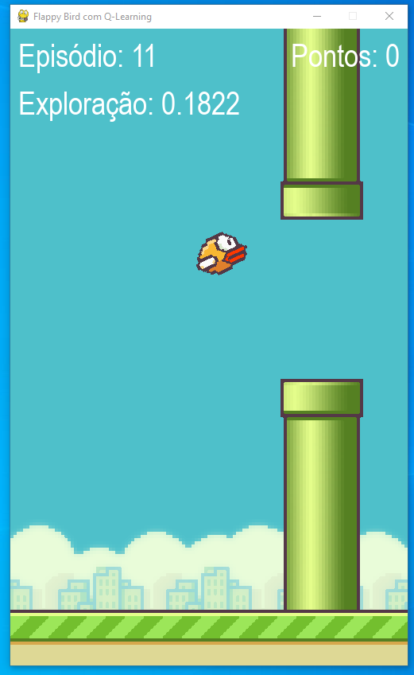
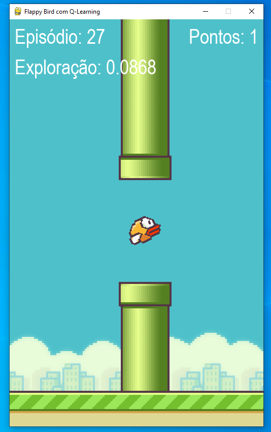

# Flappy Bird AI com Q-Learning  
**Nome do Projeto**: FlappyBirdQLearning-01656165-StaloneAugusto  

## 🎯 Introdução ao Projeto  
Este projeto implementa um agente de Inteligência Artificial utilizando **Q-Learning** para jogar o clássico *Flappy Bird* autonomamente. O objetivo é demonstrar como algoritmos de aprendizado por reforço podem ser aplicados em ambientes de jogos, permitindo que o agente aprenda a tomar decisões ótimas (pular ou não pular) para maximizar sua pontuação.  

O jogo foi desenvolvido em **Python** com a biblioteca **Pygame**, e o agente utiliza uma **tabela Q** para armazenar e atualizar suas experiências, aprendendo através de tentativa e erro com um sistema de recompensas/punições.  

---

## 🛠 Tecnologias e Bibliotecas Utilizadas  
- **Python 3.x** (Linguagem principal)  
- **Pygame** (Renderização do jogo e interface gráfica)  
- **NumPy** (Cálculos numéricos e manipulação de arrays)  
- **Matplotlib** (Geração de gráficos de desempenho)  
- **Collections** (Implementação eficiente da tabela Q com `defaultdict`)  

**Instalação das dependências**:  
```bash
pip install pygame numpy matplotlib
```

---

## 🧠 Algoritmos Aplicados  
### **Q-Learning**  
- **Política ε-greedy**: Balanceia **exploração** (ações aleatórias) e **exploitation** (ações baseadas no aprendizado).  
- **Atualização da Tabela Q**:  
  ```python
  Q(s, a) ← Q(s, a) + α * [r + γ * max(Q(s', a')) - Q(s, a)]
  ```
  - `α` (taxa de aprendizado): **0.2**  
  - `γ` (fator de desconto): **0.95**  
  - `ε` (taxa de exploração): Decai de **0.3** para **0.01** ao longo do treinamento.  

### **Discretização do Estado**  
O estado do jogo é representado por:  
1. **Distância horizontal** ao cano (`distancia_x // 50`).  
2. **Distância vertical** ao centro do vão (`distancia_centro_y // 25`).  
3. **Velocidade vertical** do pássaro (`velocidade // 5`).  

---

## 📊 Cálculos e Fórmulas  
### **Recompensas**  
| Ação                     | Recompensa |  
|--------------------------|------------|  
| Passar por um cano       | `+100`     |  
| Bater em obstáculo       | `-1000`    |  
| Nova pontuação máxima    | `+100`     |  
| Sobrevivência por frame  | `+0.5`     |  

### **Decaimento da Exploração**  
A cada episódio, `ε` é reduzido multiplicando por **0.9995**, com valor mínimo de **0.01**.  

---

## ▶ Como Executar o Projeto  
1. **Clone o repositório**:  
   ```bash
   git clone https://github.com/seu-usuario/FlappyBirdQLearning-01656165-StaloneAugusto.git
   cd FlappyBirdQLearning-01656165-StaloneAugusto
   ```

2. **Execute o jogo**:  
   ```bash
   python flappy_bird_qlearning.py
   ```

3. **Controles**:  
   - `ESC`: Encerra o programa.  
   - O agente toma decisões automaticamente.  

4. **Treinamento**:  
   - O agente começa com alta exploração (`ε = 0.3`).  
   - A cada 100 episódios, gráficos de desempenho são exibidos.  

---

## 📈 Resultados e Comentários Finais  
### **Desempenho Observado**  
- **Episódios iniciais**: 0–5 pontos (agente explora aleatoriamente).  
- **Após ~500 episódios**: Pontuação consistentemente acima de 10.  
- **Melhor pontuação**: Entre 15–30 pontos.  

### **Gráficos Gerados**  
1. **Recompensas por Episódio**: Mostra a evolução das recompensas.  
2. **Pontuação por Episódio**: Indica a melhoria na estratégia.  
3. **Taxa de Exploração (ε)**: Decai ao longo do tempo.  

### **Imagens do Projeto em Execução**  

#### Tela do Jogo - Episódio 11  
  

#### Tela do Jogo - Episódio 27  
  

#### Gráficos de Desempenho - Episódio 99  
  

### **Dificuldades Encontradas**  
- **Definição do espaço de estados**: Encontrar a granularidade ideal exigiu ajustes.  
- **Sistema de recompensas**: Valores muito altos ou baixos levavam a comportamentos subótimos.  
- **Tempo de treinamento**: O agente precisou de centenas de episódios para aprender.  

### **Conclusão**  
O projeto demonstra com sucesso a aplicação do **Q-Learning** em um ambiente de jogo, destacando a importância de:  
- Uma **boa discretização do estado**.  
- **Recompensas/punições bem calibradas**.  
- **Paciência no treinamento** (o agente melhora gradualmente).  

**Próximos passos**:  
- Implementar **Deep Q-Learning (DQN)** para lidar com espaços de estado contínuos.  
- Adicionar mais métricas de avaliação (ex: taxa de sucesso por episódio).  

---

**Autor**: Stalone Augusto (Matrícula: 01656165)  
**Repositório**: [GitHub](https://github.com/seu-usuario/FlappyBirdQLearning-01656165-StaloneAugusto)